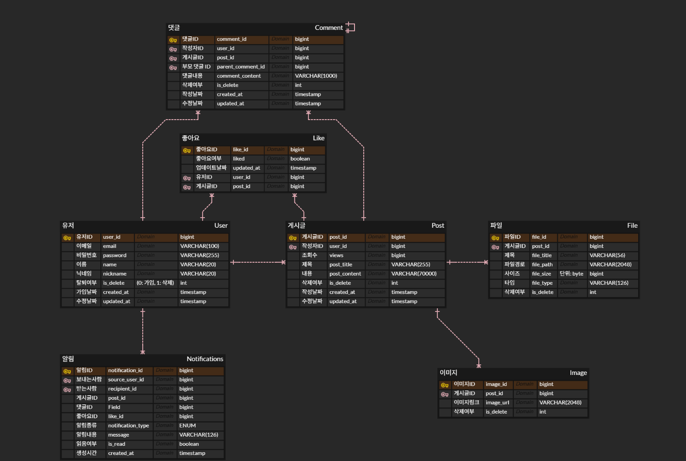

# 게시판 API 서버

### 사용 기술

    

<br>

---

### 설치 및 실행 방법

1. **레포지토리 클론**

   ```bash
   git clone https://github.com/k1minchae/nestjs-project.git
   ```

<br>

2. **.env 파일 생성**

   <code>.env.development</code> 파일과 <code>.env.production</code> 파일을 복사하여 project 루트에 추가합니다.

<br>

3. **Docker 실행**

   ```bash
   docker-compose -f docker-compose.dev.yml up --build

   또는

   docker-compose -f docker-compose.dev.prod up --build
   ```

<br>

4. **Swagger UI 확인**

   http://localhost:3000/api 에서 Swagger UI를 통해 API를 확인할 수 있습니다.

<br>

---

### ERD


